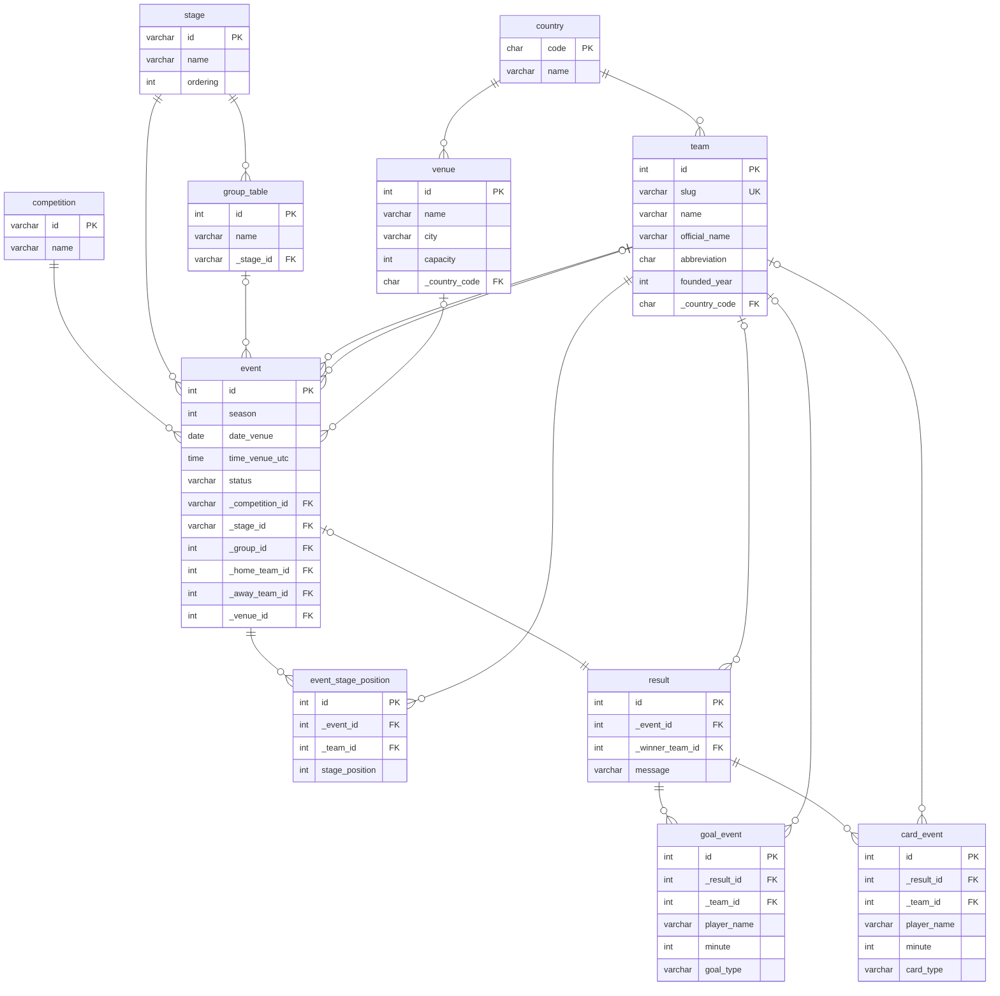

## Why `result` stores `_winner_team_id` directly

In most cases the winner can be inferred from goal counts, but goals alone are not always enough. Matches can be decided by penalty shootouts, walkovers, or administrative decisions where no goals are recorded. Storing `_winner_team_id` as an explicit field captures these outcomes without requiring special-case logic in every query that asks who won.

The `message` column exists for the same reason. It holds a note for any result that cannot be expressed through goals alone.